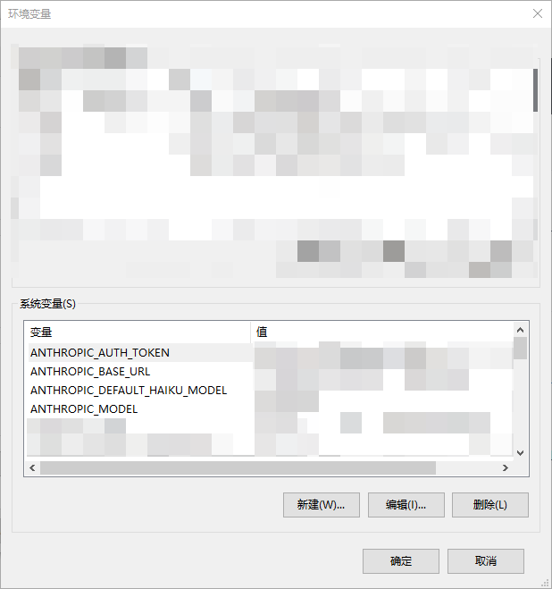
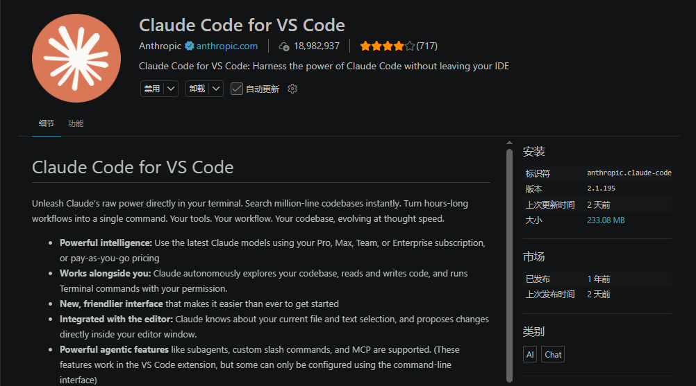

+++
date = '2026-06-09T16:47:42+08:00'
draft = false
title = 'CludeCode_01(环境构建)'
tags = ["AI","ClaudeCode"]
+++

## 引言

为了跟随时代的步伐，深入贯彻落实社会“降本增效”的口号，逐渐要开始学习AI的使用。虽然不知道这些对未来能有多少帮助，但是面对网络上铺天盖地的宣传，不得不承认还是焦虑了。

网络上很多什么AI漫剧、什么文科生自己独立软件、靠AI分析股票爆赚、养虾养马、还有什么一行代码不用写工作全托管的。说实话我个人用起来感觉AI确实很强大，但是上面提到的这些，都需要大量的成本，而且可能没有想象当中那么强大。在经过一段时间高强度的焦虑学习之后，现在逐步开始摆烂，觉得其实不应该如此，对待AI还是用典型的嵌入式思维来看待吧：“新东西来了一定要看看，但是要不要深入研究，取决于是否满足需求”。博主这段时间正处于希望中的转型期，所以闲暇时间也来记录一下这个接触和学习过程。

## 环境搭建

### 安装命令行工具

Claude Code是通过npm(Node Package Manager)来进行分发的，我们先在电脑上安装Node.js。

可以在官网位置直接进行获取安装<https://nodejs.org/zh-cn>，安装完成后在PowerShell或者CMD里面查看版本号用于验证是否安装成功，如果会显示版本号则认为安装成功。

``` powershell
node -v
npm -v
```

然后通过npm来安装ClaudeCode应用，在PowerShell或者CMD里面输入下面的指令。

``` powershell
npm install -g @anthropic-ai/clude-code
```

安装完成后，在终端输入`claude`，即可打开claude应用，代表安装成功。

### 配置环境变量

由于ClaudeCode是anthropic发行的自己的闭源工具，他们也有自己的模型可以购买，如果已经订阅了应该直接登录账号即可，博主使用的是国产模型的替代方案，默认情况下打开ClaudeCode的时候，好像必须登录才能使用，我们可以配置环境变量来改变这一策略。

环境变量在“此电脑”->“属性”->“高级”->“环境变量”，或者直接在搜索里面输入环境变量也可以直达。然后在用户/系统变量里面任选其一，新建新的变量值就可以了，博主此时是添加在系统变量里面了。



其中各个参数的含义如下表所示，可以全部添加，也可以根据自己的实际使用情况来进行取舍。

|参数名|作用说明|
|--|--|
|ANTHROPIC_BASE_URL|指定 API 网关地址，将 Anthropic SDK 请求转发到指定模型|
|ANTHROPIC_AUTH_TOKEN|API 鉴权 Token，用于访问模型服务|
|ANTHROPIC_MODEL|默认使用的主模型|
|ANTHROPIC_DEFAULT_OPUS_MODEL|	映射 Claude Opus 模型（原生模型）|
|ANTHROPIC_DEFAULT_SONNET_MODEL|映射 Claude Sonnet 模型（原生模型）|
|ANTHROPIC_DEFAULT_HAIKU_MODEL|	映射 Claude Haiku 模型（轻量快速原生模型）|
|CLAUDE_CODE_SUBAGENT_MODEL|子 Agent 使用的模型（通常用于快速任务）|
|CLAUDE_CODE_MAX_OUTPUT_TOKENS|控制模型最长的输出长度，可调整|

设置完毕之后要重启终端才可以保证生效，再次执行`claude`启用可以发现模型就变成了我们的自定义模型了。

### 插件调用

博主使用ClaudeCode的场景多数是代码开发，因此更常用的是结合VSCode的插件来使用，这样的好处就是和编辑器绑定，可以直接片段式的处理代码，编辑界面选中的行，会在插件里面直接感应到。

插件本质上也是调用的claude终端内容，只不过是封装了一个操作界面，直接在VSCode里面搜索Claude就可以找到对应的插件，全名叫`Claude Code for VS Code`，下方还带Anthropic和蓝色对勾的标记，直接安装即可。



安装之后直接启动即可，有命令行和操作界面两种使用方法，本章节仅描述环境搭建因此不在此赘述。VSCode的插件实际上是套了一层操作界面的壳子，本机如果没有前面的步骤安装过ClaudeCode的话，这里打开也是用不了的。

经过博主的了解，使用自定义模型的场景下，如果配置了前面的环境变量，这里不需要进行操作就可以正常使用了。如果没有配置环境变量，直接打开应该会停留在登录界面，此时可以通过设置VSCode的`setting.json`来通过插件配置环境。

``` json
 {
    "name":"ANTHROPIC_BASE_URL",
    "value": "",
    "description": "Claude Code API 基础地址，指向内部 Anthropic 代理服务"
},
{
    "name": "ANTHROPIC_AUTH_TOKEN",
    "value": "",
    "description": "Claude Code API 认证令牌，用于访问代理服务的身份验证"
},
{
    "name": "ANTHROPIC_DEFAULT_HAIKU_MODEL",
    "value": "",
    "description": "Claude Code 默认使用的轻量模型名称"
},
{
    "name": "CLAUDE_CODE_MAX_OUTPUT_TOKENS",
    "value": "",
    "description": "Claude Code 最大输出 token 数，控制单次响应的最大长度"
},
{
    "name": "ANTHROPIC_MODEL",
    "value": "",
    "description": "Claude Code 主模型，自动选择最优模型处理复杂任务"
},
{
    "name": "ANTHROPIC_DEFAULT_OPUS_MODEL",
    "value": "",
    "description": "Claude Code 默认 Opus 模型，用于高复杂度推理任务"
},
{
    "name": "ANTHROPIC_DEFAULT_SONNET_MODEL",
    "value": "",
    "description": "Claude Code 默认 Sonnet 模型，平衡速度与质量"
},
{
    "name": "CLAUDE_CODE_SUBAGENT_MODEL",
    "value": "",
    "description": "Claude Code 子代理模型，用于后台并行任务处理"
}
```

和前面的环境变量设置差不多，只不过这下变成了json格式。好像是环境变量优先级更高，如果环境变量已经设置过了，这里什么都不加也是没问题的，如果这里和环境变量都加了，好像是以环境变量里面填写的内容为准。

## 后记

本篇章仅记载ClaudeCode的安装和配置过程，基础使用说明和使用技巧后续章节会进行补充，这里也就不再多说了。