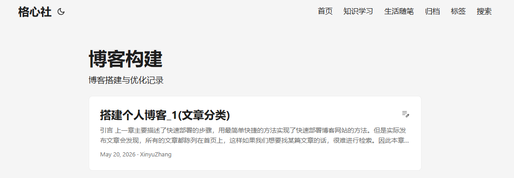

+++
date = '2026-05-20T11:57:49+08:00'
draft = false
title = '搭建个人博客_1(文章分类)'
tags = ["博客","hugo"]
+++

## 引言

上一章主要描述了快速部署的步骤，用最简单快捷的方法实现了快速部署博客网站的方法。但是实际发布文章会发现，所有的文章都陈列在首页上，这样如果我们想要找某篇文章的话，很难进行检索。因此本章则介绍如何给文章分类。

## 概念描述

经了解，hugo想要给文章分类有两个方向，一个是文件夹分类法(Section)，一个是标签分类法(Taxonomy)。

特性|文件夹分类法|标签分类法
--|---|---
定义方式|目录结构|Front Matter 字段
一篇文章属于|只能一个 Section|可以多个分类/标签
URL 结构|/section/subsection/|/categories/xxx/
灵活性|低（需移动文件）|高（修改元数据即可）
适用场景|固定栏目、频道|交叉分类、标签

简单来理解，就是一种靠文件结构，一种靠标签。

文件结构虽然创建操作复杂，但是对于现在的文件系统而言更直观，直接从物理层面上就做了隔离。但局限性就是需要先知道其根类型，可能要一层层进去才能找到自己想要的文章。

标签方法在物理层面上没办法统一的规划文章，除了靠目录书签或者展示出来的结果，才能直观的看到一类内容在一起。但其可以给同一篇文章添加多个关键词，这样我们只要有个大致的想法就可以找到跟这个关键词相关的所有内容。

## 方案选择

为什么我们必须只选择一种方式呢？我们可以即使用文件结构的方式使其物理分类，又可以给文章打标签，使其关联在一起，这二者是不冲突的。

## 实际操作

### 物理分类

在上一章我们创建新文章，使用的是如下命令：

```Shell
hugo new content content/posts/hello-world.md
```

这样执行之后，会在指定路径下创建一个带有文章头的文件。现在进入到content文件夹下我们可以直观的看到有一个posts文件夹，然后所有的内容全都堆积在这里面。

现在我们要做的就是给这些内容分类。

以博主书写这篇文章时规划的分类框架为例，我想要记录我的学习过程以及我的生活感悟，而现在学习的内容一个就是本文所介绍的博客构建，另一个就是AI应用方面的内容。同时我们还注意到，文章里面如果想要放图片，图片源文件也要放到工程里面，那么现在一篇文章可能包含一个markdown文件，以及数个图片文件。

这样来看的话，文件结构已经很清晰了。

```Shell
content
├── knowledge
│   ├── blog
│   │   ├── build-blog-01
│   │   │   ├── index.md
│   │   │   ├── image-1.png
│   │   │   └── image-2.png
│   │   └── build-blog-02
│   │       ├── index.md
│   │       ├── image-1.png
│   │       └── image-2.png
│   └── AI
└── life
```

此时HUGO会尝试自动识别整个文件结构，但现在还有几个问题，一个是HUGO怎么知道这些分类要放在哪里？还有一个是HUGO怎么知道层级递进关系中哪些是分类，而哪些是要展示出来的层级？

这里使用英文的原因有两点，一个是担心可能的常见问题，中文路径不识别。另一个是涉及url字段，这个后文中会详细介绍。

我们要做两件事，一件事是标记这是一个要展示的分级，一个就是在界面上创建索引。

#### 创建索引

我们现阶段，可以先让我们博客上方的导航视窗上显示这些大的分类，然后点进去再看到小的分类，那么我们要在配置文件`hugo.toml`中添加导航视窗的相关内容。

```toml
# =======分类和标签设计=======
[[menu.main]]
  name = "首页"
  url = "/"
  weight = 10

[[menu.main]]
  name = "知识学习"
  url = "/knowledge"
  weight = 20

[[menu.main]]
  name = "生活随笔"
  url = "/life"
  weight = 30
```

这些选项参数很好理解，name就是要展示在界面上的按钮名称，url则是点击进入这个分类之后链接会跳转的尾缀，weight是排列权重，这个权重不一定要按照顺序，只要数值大的就靠后。

指的注意的是，现在我们用使用目录即结构的方式，因此此处的url要和实际的目录文件夹名一一对应，比如首页就是跟节点，知识学习我想要展示knowledge下的内容，则url指向knowledge，假如前面是使用的中文文件夹，例如知识学习，则这里的`url = "知识学习"`。

#### 标记分级

事实上HUGO此时虽然知道了结构的存在，并且我们上一步也制定了界面导航栏对应的路径位置，但对于嵌套的分层，HUGO不知道哪些是想要显示出来用作分类的，哪些是开发者单纯的为了管理方便而创建的。

因此我们要给想要显示出来作为分类的文件夹层级，创建一个标记。说是标记，但是实际上内容可以只有标题和描述。

我们在knowledege、life、AI、blog下面分别创建_index.md，然后在文件中添加如下内容，以blog下的文件内容为例：

```markdown
---
title: "博客构建"
description: "博客搭建与优化记录"
---
```

这样hugo在构建时候就会识别到这是一个需要显示出来的分支结构，当点开到这个界面时，标题位置会显示标题和描述的字样。



现在的整个文件夹结构变成了下面这个样子

```Shell
content
├── knowledge
│   ├── blog
│   │   ├── build-blog-01
│   │   │   ├── index.md
│   │   │   ├── image-1.png
│   │   │   └── image-2.png
│   │   ├── build-blog-02
│   │   │   ├── index.md
│   │   │   ├── image-1.png
│   │   │   └── image-2.png
│   │   └── _index.md
│   ├── AI
│   │   └── _index.md
│   └── _index.md
└── life
    └── _index.md
```

至此我们的分类功能就已经完全实现，界面上通过上方的导航视窗，可以看到根分类节点(知识学习)，点进去之后可以看到各种叶子节点(AI应用、博客构建)，然后点开对应的叶子节点，下面罗列我们写的文章(搭建个人博客_1、搭建个人博客_0)。

### 模板分类

除了我们自定义的分类方法以外，还有一些很好用的通用分类方法，比如标签分类、检索功能等等。这里我们来介绍三个papermod本身就支持的，很好实现的三个类型，归档、标签、搜索。三个功能一次满足。

#### 创建索引

和前文操作是一致的，我们在导航栏中创建三个功能对应的索引，在hugo.toml中添加如下内容。

```toml
[[menu.main]]
  name = "归档"
  url = "/archives"
  weight = 40

[[menu.main]]
  name = "标签"
  url = "/tags"
  weight = 50

[[menu.main]]
  name = "搜索"
  url = "/search"
  weight = 60
```

#### 标记分级和模板

这里操作和前文也类似，但略有差别，首先我们来创建文件结构，archives、tags、search，然后每个文件夹下再创建一个_index.md。

现在整个文件结构，包含上面的自定义分类，变成了这样的：

```Shell
content
├── knowledge
│   ├── blog
│   │   ├── build-blog-01
│   │   │   ├── index.md
│   │   │   ├── image-1.png
│   │   │   └── image-2.png
│   │   ├── build-blog-02
│   │   │   ├── index.md
│   │   │   ├── image-1.png
│   │   │   └── image-2.png
│   │   └── _index.md
│   ├── AI
│   │   └── _index.md
│   └── _index.md
├── life
│   └── _index.md
├── archives
│   └── _index.md
├── search
│   └── _index.md
└── targs
    └── _index.md
```

然后我们来书写_index.md的内容，先来看归档(archives)的内容：

```markdown
---
title: "归档"
layout: "archives"
---
```

这里title很好理解，就是标题，也就是显示出来的内容。下面的两个前面没有见过，这里的layout是指定Hugo用哪个模板来渲染这个页面，这里是直接使用PaperMod主题提供的archives模板，生成按时间归档的文章列表。

再来看搜索(search)的内容：

```markdown
---
title: "搜索"
layout: "search"
placeholder: "输入关键词搜索..."
---
```

title和layout我们已经知道了是什么含义，这个搜索会多出来一个placeholder，这个内容实际上是显示在搜索框内部的文字，在用户没有输入文字的时候，展示这里的字样用于引导用户。

最后是tags，这个和归档一样的，只要标题和模板就可以了：

```markdown
---
title: "标签"
layout: "tags"
---
```

至此我们就已经成功添加了好用的模板分类方法，指的注意的是，归档和搜索都可以根据时间和标题等信息自动的去检索，但是标签是个额外的功能，这个标签就是类似我们写论文里面附上的关键词，查看文章可以知道其主题关联的关键词，查找关键词也列举与之有关的文章。

#### 关键词标签

其实很简单，真的就类似我们写文章论文一样，只要在文章的头里面添加对应的标记就好了，在我们的文章头里面添加`tags = [xxx]`，以我们的上一篇文章为例，添加关键词"HUGO"、"博客"。

```markdown
+++
date = '2026-04-12T13:42:01+08:00'
draft = false
title = '搭建个人博客_0(快速部署)'
tags = ["博客","hugo"]
+++
```

如此，文章的结尾就可以显现文章的标签关键字，而切换到标签界面，也可以显示对应的tags，点击tags会展示所有带这个标签的内容。

## 后记

博主在操作过程中也遇到了很多问题，当然分类的方法也比较多，本文介绍的方法是博主操作过后觉得最简单方便的方法，让我们共同进步吧，日拱一卒！