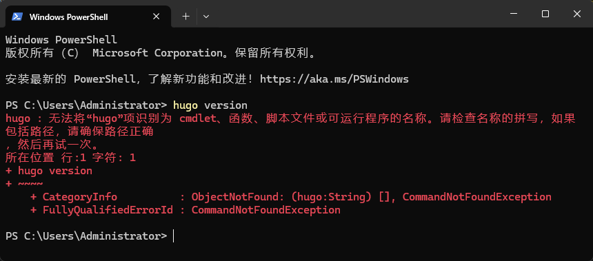
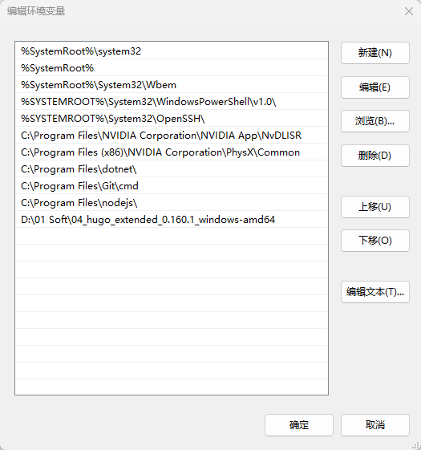

+++
date = '2026-04-12T13:42:01+08:00'
draft = false
title = '搭建个人博客_0'
+++

## 引言

笔者早就想搭建一个个人博客，但一直没有下定决心开始，从最开始的想要购买服务器，到后来听说使用gitee page可以远程托管静态博客页面，因为方法的多样性和自己的懒惰，一直都没能开始。  
如今终于选定了一种较为简单的方式开始了这一工作，实践过程发现只是单纯的实现这一目标并不困难，虽然也踩了很多坑，但最终还是搞定了一个简单的博客界面，因此决定将这个过程记录下来。  
虽然说在博客里面记载搭建博客流程很奇怪，但此时的博客仍处于初级阶段，对于一些美化、高级功能等，笔者也尚未摸索清楚，甚至连markdown语法都用的不是很熟练，故本文起名为《搭建个人博客-0》，旨在逐渐记录完善过程。

## 搭建步骤

### 搭建方式选用

最开始的时候，我有考虑购买云服务器来进行搭建，但是说实话一方面是自己没想好一个云服务器除了这个博客以外还能用在哪，另一方面是除了C/C++、一点点的python知识，对于制作网页所听说需要使用JAVE等完全一窍不通。  
再三查询并考虑过之后，决定使用github+hugo的方式来实现。根据deepseek的分析，这种方法的优点是成本比较低，本身博客界面基本上都是markdown写的文本来存放，而且安全度较高，静态的博客界面+github服务器的安全策略，可以让我这个小白也能轻易玩转，至于其他类似的静态博客框架例如HEXO，我还没有去了解，后续如果学有余力的时候再来看吧。

### 搭建开始

#### 环境搭建

注册github账号这个就不赘述了，首先第一步就是要安装Hugo和Git了。  
git的下载可以直接百度搜索，或者通过链接跳转<https://git-scm.com/install/windows>.  
Hugo则是可以通过github上直接拉取到，链接为<https://github.com/gohugoio/hugo>  
这里的安装较为简单，不进行赘述，git的安装完成后可以通过在桌面等位置点击右键，会有git的选项；hugo好像是不需要安装，拉取下来的.exe文件就已经可以直接执行了，可以用下面的命令验证hugo是否可以正常执行。  

``` powershell
hugo version
```

我在执行的时候遇到了一点问题，发现找不到hugo这个命令，如下图所示。

这个问题在前面也提到过了，因为hugo拉取下来不用安装，因此系统无法直接识别到这个应用。我们将其添加到环境变量中即可。  
打开坏境变量配置，双击系统变量中的“Path”，新增一条，然后将刚才下载的hugo.exe文件夹复制进去即可，例如我将刚才下载下来的文件放到了D盘下，那么按照如图所示填写即可。

至此需要的基础环境就已经搭建完成。

#### 博客框架创建

创建博客框架过程实际上完全由hugo自己完成，我们只需要执行命令即可，例如我创建一个myblog文件夹当作我的博客工程，只需要执行下述代码。

``` powershell
hugo new site myblog
```

框架好了以后，我们来安装一个默认主题，我还没有摸透这个文件夹结构到底是怎样的，不过现阶段先主要让博客可以正常运转起来，以经典的PaperMod为例，执行下述命令。

``` powershell
git submodule add https://github.com/adityatelange/hugo-PaperMod.git themes/PaperMod
```

事实上我在执行这一步的时候发现不知道是网络的原因还是什么，从github上直接add进来会报错，明明前面下载hugo的时候都没问题，如果上面的操作不能正常生效，也可以下载下来手动放入themes下。  

#### 框架简单配置

在我们上一步创建的myblog文件夹下，有一个hugo.toml文件，这个文件就是我们要处理的配置文件，我们要做的是设置语言环境、大标题、主题，以及可以创建一个默认作者。  
对于这个具体的配置项，我还没有完全搞懂，姑且先包含这些内容，我们先来保证博客可以正常运行，文件内容如下文所示。

``` python
#baseURL = 'https://GitHub用户名.github.io/'  # 本地测试时可先注释掉
languageCode = 'zh-cn'
title = '我的博客'
theme = 'PaperMod' #指定主题，与主题文件夹名称一致

[params]
  author = '<作者>'
  description = '<描述>'
```

#### 尝试创建一篇文章

创建文章我们依旧可以使用hugo本身来创建，使用hugo new命令可以创建一个带标头的markdown文档，这里我看的教程里面是放到了content/posts/下，我不清楚这个路径有没有具体的要求，但是姑且先放在这个下面，来看下是否能正常在博客中添加一篇文章。

``` powershell
hugo new content content/posts/hello-world.md
```

编辑文章内容，值得注意的是有一个draft选项，这个选项默认为true，这种模式下这篇文章会认为是一部草稿，不会在最终的效果中显示，但是当我们debug的时候可以看到，因此发布的文章这个要置位成false。

``` markdown
+++
date = '2026-04-11T12:44:00+08:00'
draft = false
title = 'Hello World'
+++


大家好，这是我的第一篇日记。记录一下今天的心情，很不错！
```

昨晚上面这些内容之后，就可以先本地预览一下效果，依旧使用hugo命令。hugo server会创建一个建议服务器，通过本地地址可以访问，从而看到当前整个博客的状态，这一过程处于debug状态，可以看到当前有多少控件和界面处于生效状态。

``` powershell
hugo server -D
```

#### github托管

在github上创建一个仓库，然后在本地的博客工程根目录下输入终端命令。

``` powershell
git init
git remote add blog <仓库地址>
```

在上库之前，我们还可以准备一个忽略文件，忽略一些Hugo生成的临时文件，保持仓库的整洁，在工程根路径下创建一个.gitignore文件，写入需要忽略的文件或路径，当前我是根据教程内容来填入的。

``` text
# Hugo 生成的文件
/public/
/resources/
/.hugo_build.lock

# 系统文件
.DS_Store
Thumbs.db
```

然后就可以将整个工程推送到github上了，按照下面的步骤执行即可。

``` powershell
git add .
git commit -m "<提交日志> 创建博客的hugo框架"
git push -u blog master
```

#### github建站和发布

进入仓库之后，选择上方“设置”再进入左侧“Pages”，将构建和部署的来源直接改为GitHub Actions。我这里是装了中文插件，github显示已经是中文了，英文原本界面的话根据这个找一下应该也可以找到，这里github就使用page服务开始建站了，我们再来配置一个自动发布流程。  
在博客工程的根路径下，创建 .github/workflows/hugo.yaml 文件，然后填入如下内容，现阶段我也没有仔细研究这个内容的细节，姑且先原样填入。

``` yaml
name: Deploy Hugo site to Pages

on:
  push:
    branches: ["main", "master"]
  workflow_dispatch:

permissions:
  contents: read
  pages: write
  id-token: write

concurrency:
  group: "pages"
  cancel-in-progress: false

jobs:
  build:
    runs-on: ubuntu-latest
    env:
      HUGO_VERSION: 0.146.0
    steps:
      - name: Install Hugo CLI
        run: |
          wget -O ${{ runner.temp }}/hugo.deb https://github.com/gohugoio/hugo/releases/download/v${HUGO_VERSION}/hugo_extended_${HUGO_VERSION}_linux-amd64.deb \
          && sudo dpkg -i ${{ runner.temp }}/hugo.deb
      - name: Checkout
        uses: actions/checkout@v4
        with:
          submodules: false  # 我们暂时不用子模块
      - name: Install PaperMod theme
        run: |
          rm -rf themes/PaperMod
          git clone https://github.com/adityatelange/hugo-PaperMod.git themes/PaperMod
      - name: Setup Pages
        id: pages
        uses: actions/configure-pages@v4
      - name: Build with Hugo
        env:
          HUGO_ENVIRONMENT: production
          HUGO_ENV: production
        run: |
          hugo \
            --gc \
            --minify \
            --baseURL "${{ steps.pages.outputs.base_url }}/"
      - name: Upload artifact
        uses: actions/upload-pages-artifact@v3
        with:
          path: ./public

  deploy:
    environment:
      name: github-pages
      url: ${{ steps.deployment.outputs.page_url }}
    runs-on: ubuntu-latest
    needs: build
    steps:
      - name: Deploy to GitHub Pages
        id: deployment
        uses: actions/deploy-pages@v4
```

再次将这个git push到库上，此时可以看到仓库顶端的操作标签内，会有一个Deploy Hugo site的工作流在运行，这就是在自动发布更新，等待执行完成出现绿色背景的对勾之后，就代表我们的此次更新推送完成，后续更新任何博客内容都只需要将新的博客文件上库即可。  
至此所有的步骤全部完成，回到仓库中“设置” -> “Pages”下，顶端会有博客的网址，点击访问网站即可看到自己创建的博客界面，和之前的hugo server看到的应该是一样的。

## 后记

笔者也是第一次搞这个博客，本文一方面是为了记录博客建站发布过程，另一方面也是想尝试一下独立发一篇博客的可能性。后续经过不断的学习，会逐步完善博客页面的功能和主题美化，现阶段先让我们享受阶段胜利的美好吧。